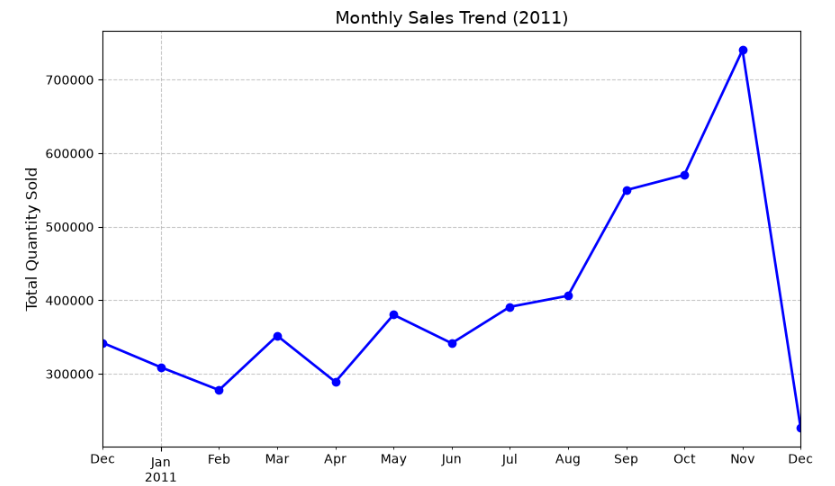
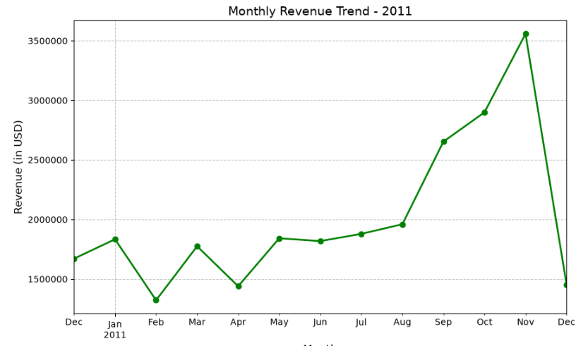

# Online Retail Sales & Revenue Analysis

A comprehensive data analysis project that explores online retail transaction records to extract actionable business insights. This project demonstrates end-to-end data processing—from database extraction and data cleaning to visualization and trend analysis.

## 🚀 Project Highlights
* **Data Extraction:** Connected to a PostgreSQL database using `SQLAlchemy` to fetch live transaction datasets.
* **Data Cleaning:** Handled missing values (Customer ID/Description) and removed anomalies (negative quantity values) to ensure data integrity.
* **Revenue Optimization:** Engineered a 'Revenue' metric (`Quantity * Unit Price`) to track financial performance.
* **Insight Generation:** Performed time-series resampling to identify seasonal sales spikes and revenue trends.

## 🛠 Tech Stack
* **Language:** Python (Pandas, NumPy)
* **Database:** PostgreSQL (SQLAlchemy)
* **Visualization:** Matplotlib, Seaborn
* **Environment:** Jupyter Notebook

## 📈 Key Findings
*(Replace the filenames below with your actual image file names if they differ)*

*Insight: The sales volume shows a significant upward trend towards the end of the year, with a massive spike in November, indicating strong seasonal holiday demand.*

*Insight: Revenue growth correlates with sales volume, confirming that our pricing strategy remains consistent during peak demand periods.*

## 📂 Project Structure
- `Retail_Sales_Analysis_SQL_Python.ipynb`: The main notebook containing the full analysis and code.
- `requirements.txt`: List of dependencies required to run the analysis.

## 🤝 Contact & Feedback
I am actively looking for Data Analyst opportunities. If you have any feedback or want to discuss this project, feel free to reach out!

- **LinkedIn:** [Insert your LinkedIn Profile Link here]
- **Email:** [Insert your Email Address here]
